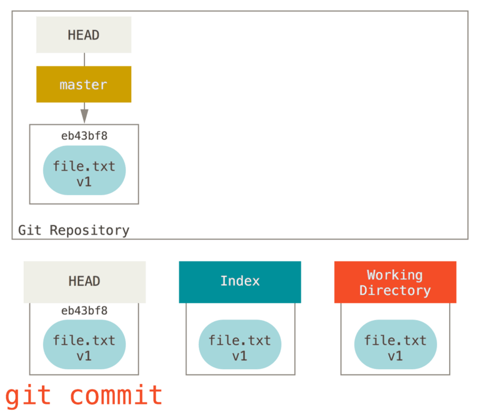

# Intro to GIT

## Git Configuration

- before using git, some configuration should be set to use across all repos on you device.
- this is a local configuration containing user information and other settings tweeked as per the user
- basic configuration might look like bellow where you set your username and email
```sh
# set your username
git config --global user.name “[firstname lastname]”
# you can use anything as username, not mandatory to use asfirst+last name
```

```sh
# set your email id
git config --global user.email “[valid-email]”
```

- this options are stored in a .gitconfig file
- on windows, ```C:\Users\<username>\.gitconfig```
- on linux, ```~/.gitconfig``` | ```/home/<username>/.gitconfig```

### example
```ini
# This is Git's per-user configuration file.
[user]
	name = username
	email = Firstname.Lastname@gmail.com
	signingkey = ~/.ssh/id_ed25519.pub
[core]
	editor = nano
[init]
	defaultBranch = main
```

## Commands

### ```git init```
```sh
# initialize empty repo in current directory
git init
```

```sh
# initialize empty git repo in named folder
# creates new folder of name provided if doesn't exist
git init <foldername>
```

### Three trees of git
- Head -> latest commit of repository, generally points to current branch, and current branch points to latest commit of that branch
- Index -> staging area -> proposed changes/ready changes for next commit
- Working tree -> working direcorty -> your local folder


### working tree
- when you create some new file and save it, it gets saved in working directory
- working tree is nothing but your local folder


### ```git add```

```sh
# add all files and folders in local folder to staging area (recursively)
git add .
```

```sh
# add particular file to staging area
git add File.txt
```


### ```git status```
```sh
# this command lists the untracked files/changes
# and files/changes in staging area
git status
```


### ```git commit```
```sh
# commits the changes in staging area into local repo
# will open some default editor for you to add your commit message
git commit
```

```sh
# commits the staged changes without opening editor 
# because we passed commit message as argument
git commit -m "my commit message"
```

```sh
# bonus commands

# create a new commit without making any change
git commit --allow-empty

# rewrites the latest commit (DO NOT USE TO MODIFY ALREADY PUSHED COMMIT)
git commit --amend
```
